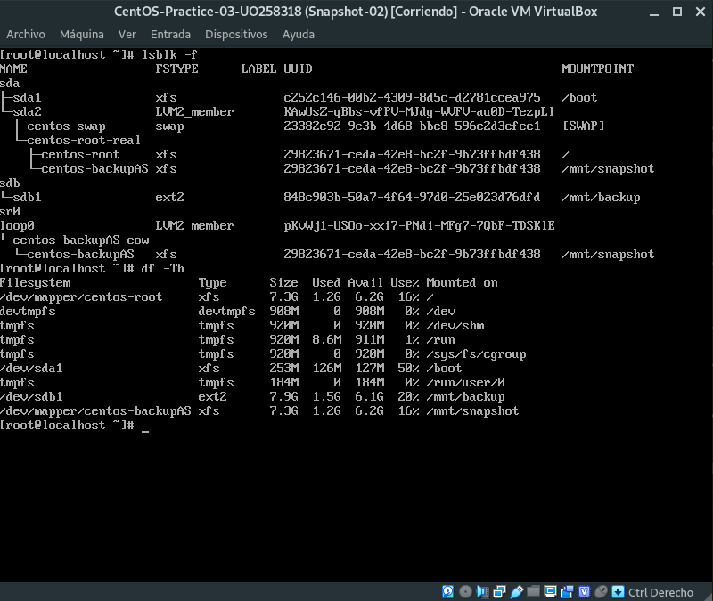
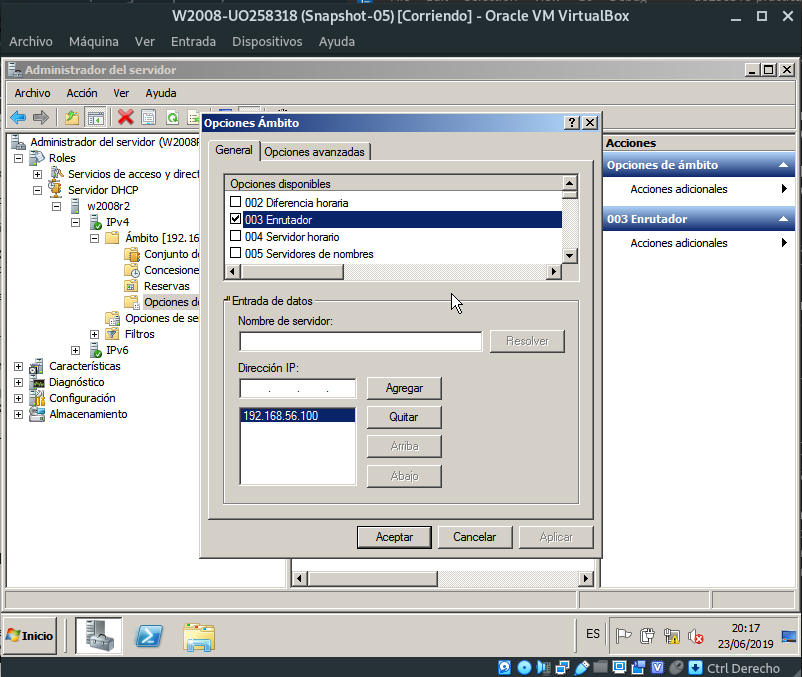

# Práctica 1

## Primera parte: Instalación Linux

Creamos un máquina virtual de tipo "Red Hat (64 bits)", en nuestro caso la hemos llamado *CentOS-UO258318*.
Seguimos las instrucciones del guión de la práctica, haciendo una instalación mínima, asignándole la contraseña EIIASR2018$ a root y por último creando un usuario *uo258318* con una contraseña a nuestra elección.

Entramos en la máquina como root.

Realizamos una actualización con el comando *yum update*.

## Segunda parte: Instalación Windows 2008 R2

Creamos una nueva máquina virtual con una instalación nueva de "Windows 2008 64 bits". Le asignamos al administrador la misma contraseña que tiene root en nuestra máquina CentOS, EIIASR2018$. Por último, le cambiamos el nombre al equipo por el de W2008R2 y le asignamos al grupo de trabajo AS.

## Tercera parte: Iniciar sesión Linux

### Tarea 1 - Kernel

Debemos cambiar la configuración del gestor de arranque GRUB para que se siga usando la versión antigua del Kernel.
Ejecutamos el comando *grep menuentry /boot/grub2/grub.cfg* para ver las opciones de menú disponibles al botar la máquina.

Una vez hecho esto, editamos (en nuestro caso con el editor *vim*) el fichero */etc/default/grub* y cambiamos la línea *GRUB_DEFAULT=saved* por *GRUB_DEFAULT=1*.

Actualizamos el grub con el comando *grub2-mkconfig -o /boot/grub2/grub.cfg* y reiniciamos la máquina para comprobar que la instalación es correcta.

Una vez hecho esto volvemos a dejar la máquina con el kernel más actualizado.

El archivo donde se encuentra el kernel es */boot/vmlinuz-3.10.0-957.21.2.e17.x86_64*

### Tarea 2 - Systemd

Ejecutamos el comando *ps ax* para ver la lissta de procesos. Vemos que el primero es systemd.
Con la orden *systemctl get-default* se nos muestra el target, que vemos que es *multi-user.target*
Para cambiar de modo utilizaremos la orden *systemctl isolate*.
Al hacer *systemctl isolate runlevel6.target* el equipo se reinicia, ya que el runlevel número seis es el nivel de reinicio de la máquina.
Si queremos que el sistema se inicie en un target diferente utilizaremos el comando *systemctl set-default*.

El PID (Process Identifier) del proceso systemd es el PID 1.

El runlevel del sistema por defecto es el multi-user, representado por el runlevel 3. Al ejecutar el comando *systemctl isolate rescue.target* el runlevel pasa a ser el 1.

Cuando el runlevel por defecto es el uno, al iniciarse el sistema se ejecuta el modo de emergencia, por lo que solo puedes loggearte como root.

Al correr el comando *systemctl isolate runlevel6.target* la máquina se reinicia.

### Tarea 3 - Login desde terminales

Con las teclas *ALT + FUNCION* podemos cambiar a una consola diferente. Iniciando sesión de nuevo como root en esta consola, podremos ejecutar el comando *ps ax | less* para buscar el PID del antiguo proceso del bash, y matarlo con el comando *kill -9 3438*.

Al volver a la primera consola vemos que se ha lanzado un proceso *agetty* que nos vuelve a pedir nuestro usuario y contraseña.

### Tarea 4 - Syslog

Ejecutamos el comando last para ver que usuarios han hecho login recientemente y los motivos de las últimas caídas del equipo.

Apagamos de forma anómala la máquina virtual desde virtualbox. Ejecutamos el comando *last* de nuevo.

Como vemos en la tercera entrada, según el output de la orden *last*, el ordenador se ha apagado debido a un crasheo.

### Tarea 5 - Ejecución periódica de comandos

El script encargado de borrar los ficheros con los logs más antiguos y de rotar cada día los ficheros de log se llama *logrotate*, y se encuentra en la carpeta */etc/cron.daily/*.

### Tarea 6 - Login desde Red

Nos conectamos mediante *ssh* a nuestro equipo por medio de *localhost*.
Una vez hecho eso, abrimos una nueva terminal con *ALT + F2* y ejecutamos el comando *ps ax | less*. Después, nos conectamos desde esta segunda terminal mediante *ssh* a *localhost*, y corremos de nuevo el comando *ps ax | less*.

Como podemos observar, los dos procesos *ssh* tienen PID 3476 para la terminal *tty1* y PID 3522 para la terminal *tty2*. 

El segundo proceso *sshd* de PID 3523 figura en la terminal *tty2*.

### Tarea 7 - Sistemas de ficheros en red

Nos descargamos *Samba* con la orden *yum install samba*, y comprobamos su manual con *man samba*.

### Tarea 8 - Correo electrónico

En esta tarea, con el agente de correo *mail*, debemos enviar un email a root.
Para leerlo, deberemos ejecutar la orden *mail*, que nos muestra una lista de los mensajes, y tecleando el número del mensaje podremos leerlo.

Por último, miraremos la ayuda de *mail* para encontrar el comando que nos permita salir del programa, que en este caso puede ser *quit*.

### Tarea 9 - Servicios de impresión.

El *Common Unix Printing System* es un estándar de impresión para sistemas tipo UNIX. Suele ser muy utilizado en entornos GNU/Linux y similares.

# Práctica 2

## A. Recuperación básica de errores durante el inicio

### 1.

Editamos el fichero */boot/grub2/grub.cfg* y buscamos la primera aparición de la palabra *linux16*. Después, cambiaremos el nombre al archivo *vmlinuz* y lo sustituiremos por *vmlinux*. Al rebotar la máquina observaremos cómo el sistema nos muestra un error advirtiéndonos de que el archivo con el nuevo nombre no existe.

### 2.

Introducimos el disco de instalación y botamos en modo de rescate. Corremos la orden *chroot /mnt/sysimage* y corregimos el fichero *grub.cfg*.

Apagamos el equipo y extraemos el disco de instalación. Al arrancarlo la primera vez el sistema no llegó a botar correctamente y se nos devuelve al menú de GRUB, pero en esta seguna ocasión la máquina inicia sin problemas y se nos pide el usuario y contraseña como es habitual.

### 3.

Volvemos a editar *grub.cfg* y realizamos el cambio de nombre *vmlinuz* por *vmlinux*. Rebotamos, y en esta ocasión editamos el nombre del kernel desde el propio GRUB.
Observamos que la máquina bota sin problemas.

### 4.

Al editar de nuevo *grub.cfg*, vemos que el nombre del kernel sigue siendo erróneo, esto se debe a que lo que hemos cambiado previamente ha sido lo que GRUB tenía cargado en memoria, no el propio archivo de configuración.

## B. Instalación de Linux con particionamiento estático

### Particionamiento manual

En esta tarea deberemos crear una nueva máquina virtual con las especificaciones vistas en la práctica 1. Esta nueva máquina tendrá dos discos, cuyas particiones quedarán de la forma que observamo en la siguiente captura.

Una vez instalado, ejecutaremos los comandos *df -Th* y *lsblk*, cuyo output se muestra en la siguiente imagen.

### Adición de un tercer disco a un sistema ya instalado

Ahora debemos crear un tercer disco desde virtualbox con el sistema apagado.

El nombre del fichero de dispositivo del nuevo disco será *sdc*.

#### Uso de fdisk

Al correr la orden *fdisk /dev/sdc* se nos muestra un mensaje de error advirtiéndonos de que el dispositivo no cuenta con una tabla de particiones.

Después de crear las particiones correspondientes, el output de *fdisk* con el parámetro *p* se visualiza en la siguiente imagen.

#### Creación del filesystem: mkfs

Ejecutaremos el comando *mkfs /dev/sdc1* para crear un sistema de archivos de tipo *ext2* en la partición de 512 MB del disco.

Una vez hecho esto, crearemos una etiqueta para esta partición usando la orden *e2label /dev/sdc1 primpart*, siendo *primpart la etiqueta que le hemos asignado.

Por último, con la orden *tune2fs -j /dev/sdc1* creamos el archivo de journal y hacemos que el filesystem sea dde tipo *ext3*.

Repetimos ahora el proceso para las otras particiones.

A la hora de ejecutar el comando *mkfs /dev/stc2* el sistema nos muestra un error debido a que esta partición es de tipo extendida, y es la que contiene las últimas dos particiones.

Para estas últimas dos particiones, los comandos que he utilizado son los siguientes.

Para *sd5*, *mkfs /dev/sdc5*, *e2label /dev/sdc5 part1logical* y *tune2fs -j /dev/sdc5*.

Para *sd6*, *mkfs /dev/sdc6*, *e2label /dev/sdc6 part2logical* y *tune2fs -j /dev/sdc6*.

#### Montaje del filesystem: mount, /etc/fstab

Después de montar los filesystems, el output de la orden *mount* es el que podemos observar en la siguiente captura.

El sistema de archivos de */dev/sdc1* es de tipo *ext3* y el de */dev/sda1* es de tipo *xfs*.

Para terminar, se nos manda cambiar el tipo de partición de Linux a FAT32 en las dos unidades lógicas, y crear filesystems de tipo *msdos* y *vfat* en ambas.

La secuencia de pasos es la siguiente:

- Orden *fdisk /dev/sdc*
- Parámetro *p* para listar las particiones
- Parámetro *t* para cambiar el tipo de partición
- Elegimos el número de la partición que deseamos modificar, ya sea la número 5 o la 6
- Parámetro *b*, que identifica a FAT32
- Parámetro *w* para escribir los cambios en disco
- Instalamos el paquete *dosfstools* con la orden *yum install dosfstools*
- Orden *umount /mnt/asuka*
- Orden *umount /mnt/kanbaru*
- Orden *mkfs /dev/sdc5 -t msdos*
- Orden *mkfs /dev/sdc6 -t vfat*

## C. Instalación de Linux con particionamiento dinámico

### Part 1

Reinstalamos un linux sobre LVM en la máquina usada previamente en esta práctica. El resultado del particionamiento lo podremos visualizar en la siguiente captura.

Una vez instalado, se nos manda ejecutar la orden *df* y mostrar el resultado, que se puede observar en esta imagen.

### Part 2

En esta parte, tendremos que asignarle el espacio del tercer disco duro al volumen lógico que está montado en */home*.

Debemos hacer los siguientes pasos:

- Orden *fdisk /dev/sdc*
- Parámetro *d* y el número de la partición a eliminar. Hacemos esto con todas las particiones
- Parámetro *n* y todas las opciones por defecto para crear una nueva partición que ocupe todo el disco
- Parámetro *t* con código *8e* para darle a la partición el tipo *Linux LVM*
- Orden *pvcreate /dev/sdc1*
- Orden *vgscan*
- Orden *vgextend centos /dev/sdc1*
- Demontamos */home* con la orden *umount /home*
- Orden *lvextend -L +512M /dev/centos/home*
- Montamos */home* de nuevo con la orden *mount /dev/centos/home /home*
- Orden *xfs_growfs -d /home*

El output de los comandos *pvscan*, *lvscan*, *df /home* es el siguiente.

## D. Instalación de Linux con RAID y recuperación ante fallos

Reinstalamos un Linux sobre RAID en la máquina que se ha estado utilizando.
Su particionamiento lo podremos contemplar en la siguiente imagen.

El output de los comandos *df*, *mdadm --detail /dev/md126* y *mdadm --detail /dev/md127* es el siguiente.

En nuestro caso el RAID montado */boot* se llama */dev/md127* y el montado en */* se llama */dev/md126*.

Indicamos que ha habido un fallo en la partición del disco *sdc* usada en el RAID1 con la orden *mdadm --manage /dev/md127 --fail /dev/sdc2*.
Ejecutamos el comando *mdadm --detail /dev/md127*, que nos devuelve el siguiente resultado.

Eliminamos el disco fallido con la orden *mdadm --manage /dev/md127 --remove /dev/sdc2*.
Ejecutamos la orden *mdadm --detail /dev/md127*, que nos muestra lo siguiente.

A continuación redimensionamos el RAID a tamaño 2 con la orden *mdadm --grow /dev/md127 --raid-devices=2*.
Al correr el comando *mdadm --detail /dev/md127* obtendremos el siguiente resultado.

Añadimos la partición del disco *sdc* como *hotspare*, utilizando la orden *mdadm -a /dev/md127 /dev/sdc2*.
El output de la orden *mdadm --detail /dev/md127* muestra lo siguiente.

En esta ocasión simularemos un fallo en el RAID 5.
Para ello, le indicaremos a la máquina que ha habido un fallo en la partición del disco *sdc*, usando el comando *mdadm --manage /dev/md126 --fail /dev/sdc3*.
Al ejecutar la orden *mdadm --detail /dev/md126* obtendremos la siguiente información.

Ahora, simularemos que el disco que ha fallado se reemplaza por un disco nuevo, inicializando la partición con *mkfs*.

Lo primero será eliminar el disco del array con la orden *mdadm --manage /dev/md126 --remove /dev/sdc3*.
Después, ejecutaremos el comando *mkfs /dev/sdc3* para simular que hemos comprado un disco nuevo.

Corremos la orden *mdadm -a /dev/md126 /dev/sdc3* para añadir el nuevo disco de igual modo que hemos hecho con el RAID 1.
Al ejecutar la orden *mdadm --detail /dev/md126* al instante vemos que el estado de la partición *sdc3* figura como *spare rebuilding*, como podemos comprobar en la siguiente captura.

Esperamos unos minutos y volvemos a ejecutar la orden *mdadm --detail /dev/md126*, para comprobar que el estado de la partición *sdc3* pasa a figurar como *active sync*, como se observa en la siguiente imagen.

## E. Administración de discos Windows

En esta última parte, trabajaremos con nuestra máquina Windows Server 2008.

Lo primero que se nos pide es hacer una consola personalizada y guardarla como *MiConsola01.msc*.

Después, tendremos que añadir dos discos de 4GB a la máquina virtual.

Desde la consola de *Administración de equipos*, inicializamos ambos discos como discos básicos, como vemos en la imagen.

En el primer disco, hacemos una única partición y la formateamos como NTFS.

En el segundo disco, hacemos dos particiones de igual tamaño y formateadas como FAT32.

Convertimos los dos discos en discos dinámicos.

Convertimos el disco de sistema a un disco dinámico.

Eliminamos la partición del disco uno y las dos del segundo disco.

Creamos un volumen simple en el disco 1 y otro en el disco 2, ambos formateados como NTFS.

Eliminamos ambos volúmenes simples y los unimos con volúmenes distribuidos. Esta nueva unidad tendrá *8GB* de capacidad.

Para finalizar, eliminamos el volumen distribuido y unimos ambos discos con volúmenes distribuidos en un volumen reflejado (RAID1). Esta nueva unidad tiene *4GB* de capacidad.

# Práctica 3

## A. Backup de un sistema en modo multiusuario mediante snapshots LVM

Lo primero que tendremos que hacer será crear una nueva máquina virtual con CentOS 7, que tendrá dos discos.
En el primero se deberá realizar una instalación mínima, dejando al segundo disco libre.

Instalamos el paquete *udev*.

A continuación, modificamos el archivo */etc/issue* añadiendo la frase "Copia de Seguridad practicas AS 2018".

Al salir de la sesión, vemos que el mensaje que acabamos de introducir aparece.

Ahora, se nos pide asignar todo el espacio del segundo disco a una única partición y a crear un filesystem en ella.

Utilizaremos los siguientes comandos:

    fdisk /dev/sdb  # Creamos una nueva partición con n y escribimos en disco con w
    mkfs /dev/sdb1
    mkdir /mnt/backup
    mount /dev/sdb1 /mnt/backup    

Creamos un archivo de 1Gb en */mnt/backup* con la orden *dd if=/dev/zero of=/mnt/backup/imagen_snapshot bs=1024 count=1M*.

Añadimos la imagen que acabamos de crear al interfaz loopback con la orden *losetup -f /mnt/backup/imagen_snapshot*.

Comprobamos con *losetup -a* que el nombre del dispositivo loop creado es */dev/loop0*.

Creamos un volumen físico en */dev/loop0* con la orden *pvcreate /dev/loop0*.

Lo añadimos al grupo de volúmenes *centos* usando el comando *vgextend centos /dev/loop0*.

Creamos un snapshot de un tamaño que sea suficiente, con la orden *lvcreate -L1000M -s -n backupAS /dev/centos/root*.

Comprobamos que todo esta correcto con el comando *lvs*.

Creamos el punto de montaje */mnt/snapshot* y montamos el snapshot */dev/centos/backupAS* en él con el comando *mount -o nouuid /dev/centos/backupAS /mnt/snapshot*.

Editamos de nuevo el archivo */etc/issue* y lo dejamos como estaba. Comprobamos que la versión del snapshot, que se encuentra en */mnt/snapshot/etc/issue*, no cambia, como podemos ver en la captura.

Por último, tendremos que hacer un backup de todos los archivos del snapshot, con la orden *tar -cvpzf /mnt/backup/backup.tgz /mnt/snapshot*.

No se puede hacer un backup de los directorios */proc* y */dev* del snapshot. 
*/proc* solo existe en la memoria del sistema, es decir, no existe en disco.
*/dev* son los dispositivos de la máquina en el instante de la copia, así que no tendría sentido que se guardaran junto a los otros datos.

Sí se podría hacer un tar de los directorios */proc* y */dev* del sistema, ya que son simplemente directorios con ficheros.

Para finalizar se nos pide capturar el output de los comandos *lsblk -f* y *df -Th*.

# Práctica 4

Configuración de una intranet con un servidor Linux

## Primera parte. Conectividad

Creamos una red anfitrión en VirtualBox y configuramos la red de la máquina Windows XP y Windows 2008 para asignarles la red que hemos creado.

Comprobamos que ambas máquinas reciben una dirección IP automáticamente.

Configuramos la máquina de CentOS utilizada en la primera práctica de tal forma que tenga dos adaptadores.
El primero tipo *NAT* y el segundo de *solo anfitrión*.

Ahora configuraremos esta máquina realizando los siguientes pasos:

- Ejecutamos la orden *uuidgen enp0s8*, que nos devuelve la string *35aa7759-d492-4bf9-9f61-9b23ad0cc62c*.
- Al introducir el comando *ip addr show* comprobaremos que tenemos dos interfaces de red, uno llamado *enp0s3* y otro *enp0s8*.
- Vamos al directorio */etc/sysconfig/network-scripts*.
- Copiamos el archivo *ifcfg-enp0s3* a *ifcfg-enp0s8*
- Editamos *ifcfg-enp0s8* para cambiar *enp0s3* por *enp0s8*.
- Cambiamos en ese archivo el parámetro *UUID* por la string anotada previamente.
- Comprobamos que tanto en *ifcfg-enp0s3* campo*ifcfg-enp0s8* el parámetro *ONBOOT* debe campo.
- Reiniciamos el servicio de red con *systemctl restart network.service*.

Hecho esto, pasamos a la máquina Windows 2008, cuya dirección *IP* es *192.168.56.102*. No tiene asociadas *DNS*, puerta de enlace ni ruta por defecto.
Tampoco podemos observar otros equipos en la red, ya que no tenemos *DNS* asignado.

La máquina Linux si tiene acceso a Internet ya que cuenta con un adaptador *NAT*.

Instalamos el paquete *bind-utils* con la orden *yum install bind-utils*, y ejecutamos el comando *nslookup horru.lsi.uniovi.es*.
Con esto comprobaremos que Linux sí puede resolver nombres, siendo el DNS *212.89.28.19*.

Ahora, deberemos añadirle un servidor secundario *156.35.14.2*, editando el archivo */etc/resolv.conf* y añadiendo la línea "nameserver 8.8.8.8".

## Segunda parte. Servidor DHCP.

Apagamos todas las máquinas virtuales y cambiamos los interfaces de red que estaban en modo *solo anfitrión* a *red interna*. Esto conlleva que el equipo anfitrión ya no forme parte de la red interna.

Arrancamos la máquina Linux. Se nos pide que el interfaz *enp0s8* tenga dirección IP estática *192.168.56.100*, con máscara *255.255.255.0*.
Para ello deberemos editar el archivo *ifcfg-enp0s8* y reiniciar la red.

A continuación instalaremos un servidor DHCP que proporcione direcciones a las dos máquinas virtuales Windows.

Para ello, lo primero será instalar el paquete *dhcp* con la orden *yum install dhcp*.
Luego, editaremos el archivo */etc/dhcp/dhcp.conf* para añadirle nuevo contenido.

Una vez editado, tendremos que arrancar el servicio *dhcpd* con la orden *systemctl start dhcpd.service*, y hacer que se arranque por defecto al iniciar el sistema con la orden *systemctl enable dhcpd.service*.

Reiniciamos las máquinas Windows y les asignamos como servidor DNS la máquina Linux.
Al hacerlo, veremos que las máquinas Windows tienen IPs dentro de la red que hemos creado.

Las máquinas Windows no tienen conectividad con el exterior, pero sí con la máquina Linux.

Las máquinas Windows no tienen conexión a Internet ya que aunque la máquina Linux ofrece el servicio de DNS, no tiene la información de los nombres de dominio.

Al ejecutar la orden *nslookup horru.lsi.uniovi.es*, podemos observar que se resuelve el nombre correctamente.

Si quisiésemos que la máquina WXP pudiera conocer que la dirección de *horru.lsi.uniovi.es* es *156.35.119.120*, tendríamos que modificar el archivo de configuración de *dhcp* del servidor Linux. 
Si tuviéramos que hacerlo sin modificar este archivo, podríamos solicitar la resolución de nombres a un servidor público.

Le indicamos al servidor DHCP que se debe encargar de proporcionar a las máquinas cliente la dirección del servidor de nombres 8.8.8.8.
Para ello haremos los siguientes pasos:

- Editamos el archivo */etc/dhcp/dhcpd.conf* y le añadimos la línea *option domain-name-servers 8.8.8.8;*,debajo de *option subnet-mask 255.255.255.0;*.
- Reiniciamos el servicio *dhcp* con la orden *systemctl restart dhcpd.service*.

Ahora, reparamos la conexión de las máquinas Windows y ejecutamos la orden *ipconfig /all*, que nos devuelve la siguiente información.

No se puede resolver la dirección de *www.google.es* porque la propia intranet no tiene conexión a Internet.

## Tercera parte. Uso de Linux como enrutador.

En esta última parte le vamos a dar acceso a internet a la red *192.168.56.0*. Para ello utilizaremos el enrutamiento de Linux y haremos que tenga la función de un traductor de direcciones (NAT).

Para ello, realizaremos las siguientes acciones:

- Habilitaremos el reenvío de paquetes (enrutamiento) entre interfaces en la máquina Linux. Para ver si ya está habilitado ejecutaremos la orden *systctl net.ipv4.ip_forward*. Como la salida es 0 deberemos crear el archivo */etc/sysct1.d/50-router.conf*, con la línea "net.ipv4.ip_forward=1". Una vez hecho eso, reiniciaremos el servicio de red con la orden *systemctl restart network.service*
- Habilitamos el enmascaramiento IP pasando el segundo adaptador a la zona interna del cortafuegos y activando el enmascarado en la zona pública.

Comprobamos que en las máquinas Windows podemos hacer *ping* al servidor de nombres 8.8.8.8, pero al hacerlo con *www.google.es* se nos muestra un mensaje advirtiéndonos de que no se puede encontrar el nombre *www.google.es*.

# Práctica 5

Configuración de una intranet con servidor W2008R2

## Primera parte. Conectividad con direcciones estáticas
 
Arrancamos las tres máquinas y comprobamos que:

- W2008 tiene acceso a Internet, ya que la orden *ping www.google.com* nos da respuesta.
- Linux no tiene una IP asignada.
- WXP tiene una IP aleatoria asignada.

Asignaremos ahora la dirección estática *192.168.56.100* al interfaz de la máquina W2008 que no está configurado como NAT. La máscara de red es *255.255.255.0*. Dejaremos vacía la dirección de la puerta de enlace.

Ahora, les asignamos la dirección IP estática *192.168.56.101* a la máquina Linux y *192.168.56.102* a la máquina WXP.

Para asignarle la dirección IP estática a Linux, tendremos que seguir los siguientes pasos:

- Orden *systemctl disable dhcpd.service* para desactivar el servicio DHCP.
- Nos movemos a la carpeta */etc/sysconfig/network-scripts/*.
- Orden *rm ifcfg-enp0s8*
- Lo editamos y modificamos el parámetro *BOOTPROTO* a "none", y añadimos las líneas "IPADDR=192.168.56.101" y "NETMASK=255.255.255.0".
- Orden *systemctl restart network.service*.

Hacemos ping entre las tres máquinas, y observamos que recibimos respuesta al hacer ping entre W2008 y WXP y viceversa, entre W2008 y Linux y viceversa, y entre las máquinas WXP y Linux.

Anotamos ahora las rutas de las tres máquinas, y las conexiones activas de cada una.

Al hacer *ping* desde las tres máquinas al exterior, comprobamos que solo W2008 tiene conexión a Internet.

Ejecutamos la orden *ipconfig /all* y determinamos que la dirección del servidor DHCP es *10.0.2.2*.

## Segunda parte. Instalación del rol DHCP en el servidor Windows

En esta segunda parte configuramos W2008 para que tenga el rol de *Servidor DHCP*.

Configuramos ahora Linux para que reciba una dirección de un servidor DHCP. 

Ejecutaremos la orden *ip route list* que nos devuelve la siguiente información.

No tenemos salida al exterior desde Linux pues el servidor W2008 aún no está funcionando como un router.

Podemos sin embargo conectarnos a la dirección IP *192.168.56.100* desde Linux ya que identifica a la máquina W2008 que le proporciona a Linux servicio DHCP.

Entramos en el servidor DHCP (W2008), y comprobamos que efectivamente está Linux en la lista de concesiones como se observa en la imagen.

Arrancamos WXP e indicamos en las propiedades de su interfaz de red que reciba una dirección IP y un DNS automáticamente.

Ejecutamos la orden *route print* que nos devuelve la siguiente información.

No tenemos salida al exterior desde WXP ya que el servidor W2008 no proporciona servicios de enrutamiento.

Podemos a pesar de ello conectarnos a la dirección IP *192.168.56.100* desde WXP ya que es la dirección de la máquina W2008 que le proporciona a WXP servicio DHCP.

Entramos en el servidor DHCP (W2008), y comprobamos que ahora la máquina WXP aparece junto a la máquina Linux en la lista de concesiones, como se puede ver en la captura.

## Tercera parte. Uso de W2008 como enrutador.

En esta parte vamos a dar acceso a Internet a la red *192.168.56.0*. Para ello utilizaremos el servicio "Enrutamiento y Acceso Remoto" de Windows 2008 y haremos como traductor de direcciones (NAT).

Agregamos en W2008 el rol *Servicios de acceso y directivas de redes*, y lo configuramos para que la dirección pública para conectarse a Internet sea *10.0.2.15*.

Rebotamos las máquinas WXP y Linux y anotamos sus tablas de rutas.

Ninguna de las dos máquinas tiene salida al exterior ya que no hemos configurado correctamente la ruta por defecto.

La ruta por defecto debería ser la del servidor de enrutamiento, que en nuestro caso es la máquina W2008.

Establecemos la ruta por defecto en Linux con la orden *ip route add default via 192.168.56.100*.

Establecemos la ruta por defecto en Windows con la orden *route add 0.0.0.0 mask 0.0.0.0 192.168.56.100 metric 25*.

Comprobamos con la orden *ping www.lukesmith.xyz* que tenemos conexión a Internet desde las tres máquinas.

## Cuarta parte. Opciones en el servidor de configuración DHCP.

Apagamos las máquinas clientes y las volvemos a arrancar. Observaremos que las rutas por defecto vuelven a ser incorrectamente *192.168.56.1*.

Para arreglar el problema, entraremos en la administración del servidor DHCP e indicaremos en la opción "Enrutador" que la puerta de enlace es *192.168.56.100* en vez de la indicada anteriormente, que era *192.168.56.1*.

Reiniciamos los clientes para que reciban por DHCP la dirección IP junto con la dirección correcta de la puerta de enlace de la ruta por defecto.

Observamos que la tabla de rutas es correcta y que de nuevo tenemos acceso al exterior, como vemos en la siguiente captura de la máquina Linux done se ejecutó la orden *ping www.crunchyroll.com*.

