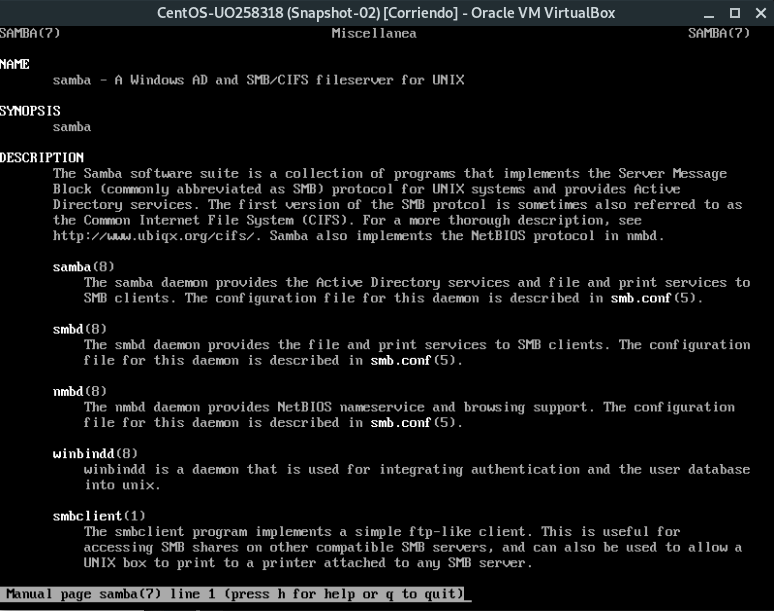

# Práctica 1

## Primera parte: Instalación Linux

Creamos un máquina virtual de tipo "Red Hat (64 bits)", en nuestro caso la hemos llamado *CentOS-UO258318*.
Seguimos las instrucciones del guión de la práctica, haciendo una instalación mínima, asignándole la contraseña EIIASR2018$ a root y por último creando un usuario *uo258318* con una contraseña a nuestra elección.

Entramos en la máquina como root.

Realizamos una actualización con el comando *yum update*.

## Segunda parte: Instalación Windows 2008 R2

Creamos una nueva máquina virtual con una instalación nueva de "Windows 2008 64 bits". Le asignamos al administrador la misma contraseña que tiene root en nuestra máquina CentOS, EIIASR2018$. Por último, le cambiamos el nombre al equipo por el de W2008R2 y le asignamos al grupo de trabajo AS.

## Tercera parte: Iniciar sesión Linux

### Tarea 1 - Kernel

Debemos cambiar la configuración del gestor de arranque GRUB para que se siga usando la versión antigua del Kernel.
Ejecutamos el comando *grep menuentry /boot/grub2/grub.cfg* para ver las opciones de menú disponibles al botar la máquina.

Una vez hecho esto, editamos (en nuestro caso con el editor *vim*) el fichero */etc/default/grub* y cambiamos la línea *GRUB_DEFAULT=saved* por *GRUB_DEFAULT=1*.

Actualizamos el grub con el comando *grub2-mkconfig -o /boot/grub2/grub.cfg* y reiniciamos la máquina para comprobar que la instalación es correcta.

Una vez hecho esto volvemos a dejar la máquina con el kernel más actualizado.

El archivo donde se encuentra el kernel es */boot/vmlinuz-3.10.0-957.21.2.e17.x86_64*

### Tarea 2 - Systemd

Ejecutamos el comando *ps ax* para ver la lissta de procesos. Vemos que el primero es systemd.
Con la orden *systemctl get-default* se nos muestra el target, que vemos que es *multi-user.target*
Para cambiar de modo utilizaremos la orden *systemctl isolate*.
Al hacer *systemctl isolate runlevel6.target* el equipo se reinicia, ya que el runlevel número seis es el nivel de reinicio de la máquina.
Si queremos que el sistema se inicie en un target diferente utilizaremos el comando *systemctl set-default*.

El PID (Process Identifier) del proceso systemd es el PID 1.

El runlevel del sistema por defecto es el multi-user, representado por el runlevel 3. Al ejecutar el comando *systemctl isolate rescue.target* el runlevel pasa a ser el 1.

Cuando el runlevel por defecto es el uno, al iniciarse el sistema se ejecuta el modo de emergencia, por lo que solo puedes loggearte como root.

Al correr el comando *systemctl isolate runlevel6.target* la máquina se reinicia.

### Tarea 3 - Login desde terminales

Con las teclas *ALT + FUNCION* podemos cambiar a una consola diferente. Iniciando sesión de nuevo como root en esta consola, podremos ejecutar el comando *ps ax | less* para buscar el PID del antiguo proceso del bash, y matarlo con el comando *kill -9 3438*.

Al volver a la primera consola vemos que se ha lanzado un proceso *agetty* que nos vuelve a pedir nuestro usuario y contraseña.

### Tarea 4 - Syslog

Ejecutamos el comando last para ver que usuarios han hecho login recientemente y los motivos de las últimas caídas del equipo.

Apagamos de forma anómala la máquina virtual desde virtualbox. Ejecutamos el comando *last* de nuevo.

Como vemos en la tercera entrada, según el output de la orden *last*, el ordenador se ha apagado debido a un crasheo.

### Tarea 5 - Ejecución periódica de comandos

El script encargado de borrar los ficheros con los logs más antiguos y de rotar cada día los ficheros de log se llama *logrotate*, y se encuentra en la carpeta */etc/cron.daily/*.

### Tarea 6 - Login desde Red

Nos conectamos mediante *ssh* a nuestro equipo por medio de *localhost*.
Una vez hecho eso, abrimos una nueva terminal con *ALT + F2* y ejecutamos el comando *ps ax | less*. Después, nos conectamos desde esta segunda terminal mediante *ssh* a *localhost*, y corremos de nuevo el comando *ps ax | less*.

Como podemos observar, los dos procesos *ssh* tienen PID 3476 para la terminal *tty1* y PID 3522 para la terminal *tty2*. 

El segundo proceso *sshd* de PID 3523 figura en la terminal *tty2*.

### Tarea 7 - Sistemas de ficheros en red

Nos descargamos *Samba* con la orden *yum install samba*, y comprobamos su manual con *man samba*.

### Tarea 8 - Correo electrónico

En esta tarea, con el agente de correo *mail*, debemos enviar un email a root.
Para leerlo, deberemos ejecutar la orden *mail*, que nos muestra una lista de los mensajes, y tecleando el número del mensaje podremos leerlo.

Por último, miraremos la ayuda de *mail* para encontrar el comando que nos permita salir del programa, que en este caso puede ser *quit*.

### Tarea 9 - Servicios de impresión.

El *Common Unix Printing System* es un estándar de impresión para sistemas tipo UNIX. Suele ser muy utilizado en entornos GNU/Linux y similares.

# Práctica 2

## A. Recuperación básica de errores durante el inicio

### 1.

Editamos el fichero */boot/grub2/grub.cfg* y buscamos la primera aparición de la palabra *linux16*. Después, cambiaremos el nombre al archivo *vmlinuz* y lo sustituiremos por *vmlinux*. Al rebotar la máquina observaremos cómo el sistema nos muestra un error advirtiéndonos de que el archivo con el nuevo nombre no existe.

### 2.

Introducimos el disco de instalación y botamos en modo de rescate. Corremos la orden *chroot /mnt/sysimage* y corregimos el fichero *grub.cfg*.

Apagamos el equipo y extraemos el disco de instalación. Al arrancarlo la primera vez el sistema no llegó a botar correctamente y se nos devuelve al menú de GRUB, pero en esta seguna ocasión la máquina inicia sin problemas y se nos pide el usuario y contraseña como es habitual.

### 3.

Volvemos a editar *grub.cfg* y realizamos el cambio de nombre *vmlinuz* por *vmlinux*. Rebotamos, y en esta ocasión editamos el nombre del kernel desde el propio GRUB.
Observamos que la máquina bota sin problemas.

### 4.

Al editar de nuevo *grub.cfg*, vemos que el nombre del kernel sigue siendo erróneo, esto se debe a que lo que hemos cambiado previamente ha sido lo que GRUB tenía cargado en memoria, no el propio archivo de configuración.

## B. Instalación de Linux con particionamiento estático

### Particionamiento manual

En esta tarea deberemos crear una nueva máquina virtual con las especificaciones vistas en la práctica 1. Esta nueva máquina tendrá dos discos, cuyas particiones quedarán de la forma que observamo en la siguiente captura.

Una vez instalado, ejecutaremos los comandos *df -Th* y *lsblk*, cuyo output se muestra en la siguiente imagen.

### Adición de un tercer disco a un sistema ya instalado

Ahora debemos crear un tercer disco desde virtualbox con el sistema apagado.

El nombre del fichero de dispositivo del nuevo disco será *sdc*.

#### Uso de fdisk

Al correr la orden *fdisk /dev/sdc* se nos muestra un mensaje de error advirtiéndonos de que el dispositivo no cuenta con una tabla de particiones.

Después de crear las particiones correspondientes, el output de *fdisk* con el parámetro *p* se visualiza en la siguiente imagen.

#### Creación del filesystem: mkfs

Ejecutaremos el comando *mkfs /dev/sdc1* para crear un sistema de archivos de tipo *ext2* en la partición de 512 MB del disco.

Una vez hecho esto, crearemos una etiqueta para esta partición usando la orden *e2label /dev/sdc1 primpart*, siendo *primpart la etiqueta que le hemos asignado.

Por último, con la orden *tune2fs -j /dev/sdc1* creamos el archivo de journal y hacemos que el filesystem sea dde tipo *ext3*.

Repetimos ahora el proceso para las otras particiones.

A la hora de ejecutar el comando *mkfs /dev/stc2* el sistema nos muestra un error debido a que esta partición es de tipo extendida, y es la que contiene las últimas dos particiones.

Para estas últimas dos particiones, los comandos que he utilizado son los siguientes.

Para *sd5*, *mkfs /dev/sdc5*, *e2label /dev/sdc5 part1logical* y *tune2fs -j /dev/sdc5*.

Para *sd6*, *mkfs /dev/sdc6*, *e2label /dev/sdc6 part2logical* y *tune2fs -j /dev/sdc6*.

#### Montaje del filesystem: mount, /etc/fstab

Después de montar los filesystems, el output de la orden *mount* es el que podemos observar en la siguiente captura.

El sistema de archivos de */dev/sdc1* es de tipo *ext3* y el de */dev/sda1* es de tipo *xfs*.

Para terminar, se nos manda cambiar el tipo de partición de Linux a FAT32 en las dos unidades lógicas, y crear filesystems de tipo *msdos* y *vfat* en ambas.

La secuencia de pasos es la siguiente:

- Orden *fdisk /dev/sdc*
- Parámetro *p* para listar las particiones
- Parámetro *t* para cambiar el tipo de partición
- Elegimos el número de la partición que deseamos modificar, ya sea la número 5 o la 6
- Parámetro *b*, que identifica a FAT32
- Parámetro *w* para escribir los cambios en disco
- Instalamos el paquete *dosfstools* con la orden *yum install dosfstools*
- Orden *umount /mnt/asuka*
- Orden *umount /mnt/kanbaru*
- Orden *mkfs /dev/sdc5 -t msdos*
- Orden *mkfs /dev/sdc6 -t vfat*
